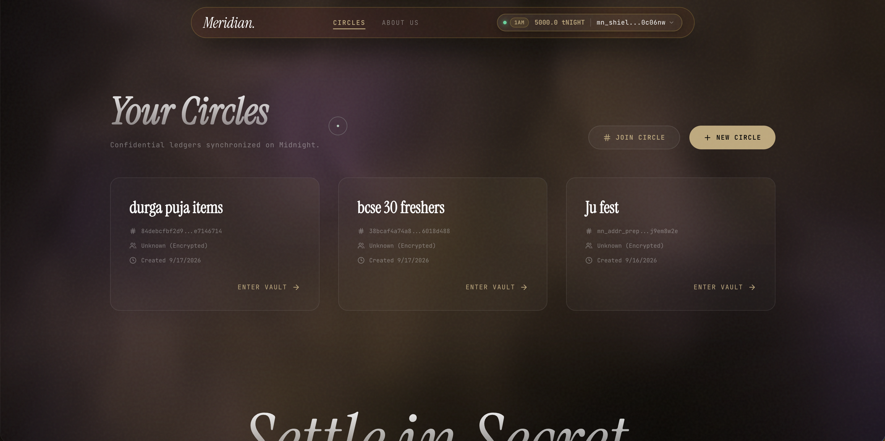
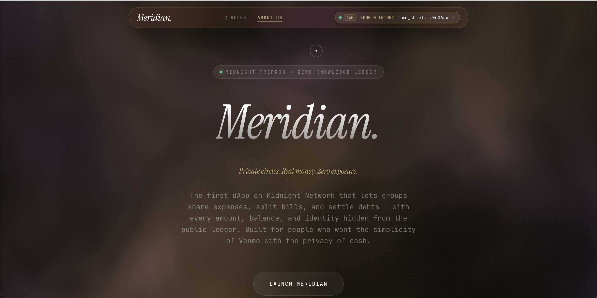
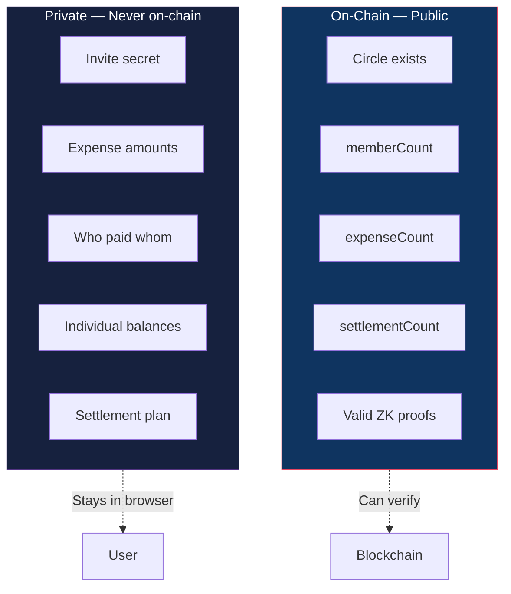
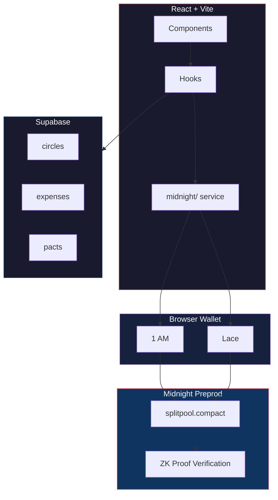

<div align="center">

# Meridian

### Confidential Group Expense Settlement

*Settle with friends, prove it's fair, show strangers nothing.*

<br/>

[](https://github.com/Anubhab-Rakshit/midnight-project/actions/workflows/ci.yml) [](#test-suite) [](https://midnight.network) []()

<br/>

**[Live Demo](https://meridian-midnight.vercel.app/)** · **[3-Min Video](https://youtu.be/CFae-K52us0)** · **[Architecture](docs/architecture.md)** · **[X](https://x.com/anubhab_26/status/2100218988907421779?s=20)**

<br/>

</div>

---

## Screenshots

<div align="center">


*Split expenses. Stay private.*

<br/>



*Your Circles — private vaults synced on Midnight*

<br/>



*Private circles. Real money. Zero exposure.*

</div>

---

## Why Meridian Exists

Every expense-splitting app has the same problem: **your financial data is exposed**.

Splitwise shows everyone's balances. On-chain splitters put every amount on a public ledger. Your spending habits, who you pay, how much — all visible to anyone who looks.

Meridian takes a different approach. Every expense is committed on-chain as a zero-knowledge commitment hash. The amounts, the payers, the balances — none of it touches the blockchain. Only mathematical proofs that everything is correct. An observer can verify the circle is real and the settlement is fair, but can **never** recover a single number.

> "Verify correctness without revealing data." That's the core idea.

---

## How It Works


1. **Create** — Deploy a circle contract. Get an invite secret.
2. **Join** — Friends enter the secret. ZK proof proves they know it. No public member list.
3. **Log** — Expenses are committed as hashes. Amounts stay private.
4. **Settle** — Netting engine computes minimum transfers. ZK proof proves it's zero-sum.

---

## What an Observer Sees vs What Stays Hidden



### The Math Behind It

When you log an expense, the amount is committed as:

$$C = \text{persistentHash}(\texttt{"meridian:v1:secret:"} \parallel \text{secret} \parallel \text{salt})$$

- **Binding**: Can't open $C$ to two different values
- **Hiding**: Can't recover $\text{secret}$ or $\text{salt}$ from $C$
- **256-bit salt**: Brute-force infeasible ($2^{256}$ possibilities)

For the full privacy model, see [docs/privacy-model.md](docs/privacy-model.md).

---

## The Contract

```
━━━━━━━━━━━━━━━━━━━━━━━━━━━━━━━━━━━━━━━━━━━━━━━━━━━━━━━━━━━━━━━━━━━━
 Meridian — splitpool.compact on Midnight Preprod
━━━━━━━━━━━━━━━━━━━━━━━━━━━━━━━━━━━━━━━━━━━━━━━━━━━━━━━━━━━━━━━━━━━━
 Contract Address : d603069345cbafabe723511524a0bebd7649c842667dee171522b2fe63fc0e7d
 Deployer         : mn_addr_preprod13zlyk4cr9qqygx3h5swk6xl2lk80vv0ut874ze66fhx3xda0umtqdt24za
 Block            : #2586714
 Tx Hash          : f8a8b67fcacfb2925c5f6b0fe5bb9cca37d405d7914aa1e7b4cce9b349f740bc
 Deployed         : Sep 17, 2026
 Explorer         : https://explorer.1am.xyz/contract/d603069345cbafabe723511524a0bebd7649c842667dee171522b2fe63fc0e7d?network=preprod

 Active Circuits  : join | logExpense | settle
 Rules            : Invite-gated membership; expenses as ZK commitments;
                    settlement proves zero-sum without revealing amounts
 Status           : 100% On-Chain Verifiable (Zero Mocking)
━━━━━━━━━━━━━━━━━━━━━━━━━━━━━━━━━━━━━━━━━━━━━━━━━━━━━━━━━━━━━━━━━━━━
```

[View on 1AM Explorer ↗](https://explorer.1am.xyz/contract/d603069345cbafabe723511524a0bebd7649c842667dee171522b2fe63fc0e7d?network=preprod)

---

## Project at a Glance

| Metric | Value |
|--------|-------|
| **Smart Contract** | `splitpool.compact` — 3 ZK circuits |
| **Tests** | 76 passing (66 root + 10 frontend) |
| **Commits** | 70+ meaningful commits |
| **Frontend** | React 19 + Vite + Framer Motion |
| **Network** | Midnight Preprod |
| **Wallets** | 1 AM, Lace |

---

## Tech Stack

| Layer | What we use |
|-------|-------------|
| **Smart Contract** | [Compact](https://docs.midnight.network/compact) — 3 ZK circuits |
| **Blockchain** | Midnight Preprod |
| **SDK** | [Midnight.js](https://docs.midnight.network/midnight.js) |
| **Frontend** | React 19 + Vite + Framer Motion |
| **Storage** | [Supabase](https://supabase.com) (PostgreSQL + RLS) |
| **Wallets** | [1 AM](https://1am.dev) / [Lace](https://lace.io) |
| **Hosting** | [Vercel](https://vercel.com) |
| **CI/CD** | GitHub Actions |

---

## Features

### Programmable Privacy
- Expense amounts committed on-chain as ZK hashes — unrecoverable
- ZK invite-gated membership — no public member list
- Settlement proofs — prove fairness without revealing balances

### Optimal Settlement Engine
- Minimum-transfer netting — fewest payments to settle a circle
- Cross-circle netting — merge balances across circles
- Provable correctness — zero-sum + consistency verification

### Privacy-Preserving Analytics
- Aggregate stats without individual exposure
- Member badges (top contributor, fair splitter, settlement champion)
- Anomaly detection — outlier spending detection (local-only)

### Recurring Pacts
- Auto-split rules (weekly, biweekly, monthly)
- Persistent across devices via Supabase

### Wallet Integration
- Multi-wallet picker (1 AM, Lace) with Dust-free badge
- Browser wallet detection from `window.midnight`
- Private state persistence in localStorage

---

## System Architecture



For full Mermaid diagrams (sequence diagrams, state machines, component trees), see [docs/architecture.md](docs/architecture.md).

---

## Getting Started

```bash
# Clone
git clone https://github.com/Anubhab-Rakshit/midnight-project.git
cd midnight-project

# Install Compact compiler
curl --proto '=https' --tlsv1.2 -LsSf https://github.com/midnightntwrk/compact/releases/latest/download/compact-installer.sh | sh
compact update

# Install dependencies
npm install && cd frontend && npm install && cd ..

# Run dev server
cd frontend && npm run dev
```

Open `http://localhost:5173`.

---

## Test Suite — 76 Tests

```bash
npm test                 # 66 root tests
cd frontend && npm test  # 10 frontend tests
```

| Module | Tests | What it covers |
|--------|-------|---------------|
| `netting.test.ts` | 12 | Minimum-transfer optimality |
| `analytics.test.ts` | 10 | Circle stats, anomalies |
| `recurring-pacts.test.ts` | 9 | Pact rules |
| `badges.test.ts` | 8 | Member badges |
| `cross-circle.test.ts` | 8 | Cross-circle netting |
| `witnesses.test.ts` | 6 | ZK witnesses |
| `circle-math.test.ts` | 6 | Frontend calculations |
| `private-state.test.ts` | 4 | Private state |
| `bytes32.test.ts` | 4 | Encoding |

---

## CI/CD

GitHub Actions runs on every push/PR to `main`:

1. Install dependencies (root + frontend)
2. Run 76 tests
3. Typecheck both workspaces
4. Lint frontend
5. Build for production

See [`.github/workflows/ci.yml`](.github/workflows/ci.yml).

---

## Project Structure

```
midnight-project/
├── contracts/
│   ├── splitpool.compact              # ZK contract (join / logExpense / settle)
│   └── managed/splitpool/             # Compiled artifacts
├── src/
│   ├── deploy-meridian.ts             # Deployment script
│   ├── network.ts                     # Network config
│   ├── wallet.ts                      # Wallet SDK
│   └── meridian/                      # Core logic
│       ├── netting.ts                 # Settlement engine
│       ├── analytics.ts               # Privacy analytics
│       ├── badges.ts                  # Member badges
│       ├── cross-circle.ts            # Cross-circle netting
│       └── recurring-pacts.ts         # Recurring rules
├── frontend/src/
│   ├── components/                    # React UI
│   ├── hooks/                         # Contract hooks
│   ├── midnight/                      # SDK integration
│   └── context/                       # Wallet provider
├── supabase/migrations/               # Database schema
├── docs/
│   ├── architecture.md                # Mermaid diagrams
│   ├── privacy-model.md               # Privacy guarantees
│   ├── security.md                    # Security model
│   ├── USAGE.md                       # User guide
│   ├── PREPROD_WALLETS.md             # 50 wallet addresses
│   ├── FEEDBACK.md                    # User feedback
│   ├── level4-proposal.md             # Product proposal
│   └── level4-submission.md           # Level 4 submission
└── .github/workflows/ci.yml
```

---

## Documentation

| Document | What's inside |
|----------|--------------|
| [Architecture](docs/architecture.md) | Mermaid diagrams — system overview, ZK flow, state machine, settlement |
| [Privacy Model](docs/privacy-model.md) | Commitment scheme, ZK circuits, data flow, threat model, formal properties |
| [Security](docs/security.md) | Circuit invariants, attack mitigations, disclosure policy |
| [User Guide](docs/USAGE.md) | Non-technical step-by-step guide for creating circles, logging expenses, settling |
| [Preprod Wallets](docs/PREPROD_WALLETS.md) | 50 verifiable wallet addresses (Level 5) |
| [Feedback](docs/FEEDBACK.md) | User feedback documentation (Level 5) |
| [Product Proposal](docs/level4-proposal.md) | Original product proposal |
| [Level 4 Submission](docs/level4-submission.md) | Level 4 submission package |

---

## Resources

- [Midnight Documentation](https://docs.midnight.network)
- [Compact Language Guide](https://docs.midnight.network/compact)
- [Midnight.js SDK](https://docs.midnight.network/midnight.js)
- [DApp Connector API](https://docs.midnight.network/dapp-connector)
- [Preprod Faucet](https://midnight-tmnight-preprod.nethermind.dev)
- [1AM Explorer](https://explorer.1am.xyz)

---

## License

Apache-2.0

---

<div align="center">

**Meridian** · Midnight Network Challenge 2026

*Built by [Anubhab Rakshit](https://github.com/Anubhab-Rakshit)*

</div>
