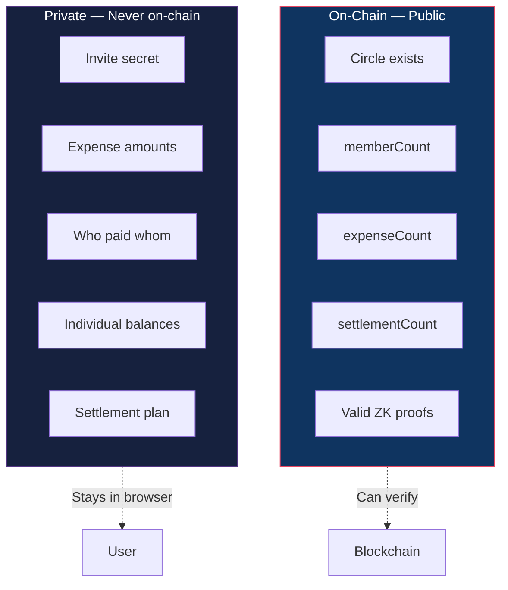
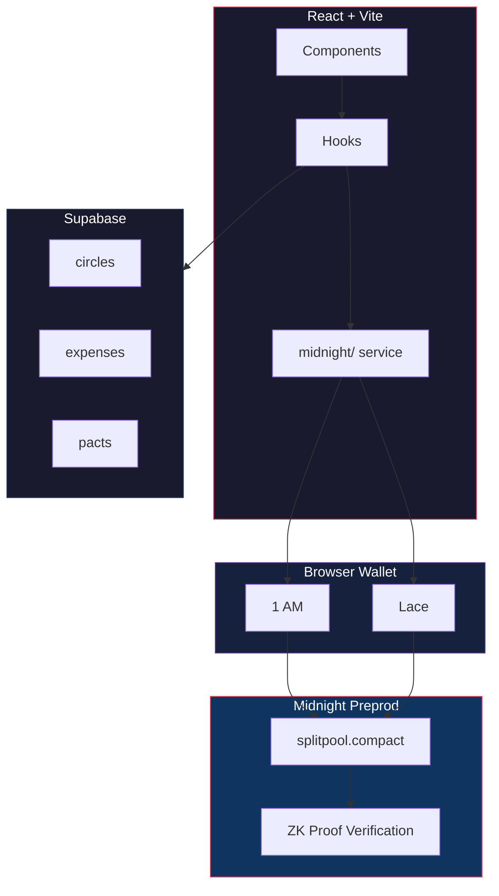

<div align="center">

# Meridian

### Confidential Group Expense Settlement

*Settle with friends, prove it's fair, show strangers nothing.*

<br/>

[](https://github.com/Anubhab-Rakshit/midnight-project/actions/workflows/ci.yml) [](#test-suite) [](https://midnight.network) []()

<br/>

**[Live Demo](https://meridian-midnight.vercel.app/)** · **[3-Min Video](https://youtu.be/CFae-K52us0)** · **[Architecture](docs/architecture.md)**

**[@meridian_split](https://x.com/meridian_split)** · [Post 1](https://x.com/meridian_split/status/2101929901075075315?s=20) · [Post 2](https://x.com/meridian_split/status/2101930152150384969?s=20) · [Post 3](https://x.com/meridian_split/status/2101930344828350598?s=20) · [Dev Thread](https://x.com/anubhab_26/status/2101745295541572002?s=20) · [Dev Thread](https://x.com/anubhab_26/status/2101745430455603693?s=20) · [Dev Thread](https://x.com/anubhab_26/status/2100218988907421779?s=20)

**[Feedback Form](https://forms.gle/hCDimFx3mNSBUo1e7)** · **[Responses](https://docs.google.com/spreadsheets/d/1zyc14ihbuKbWa3QTvLeydI8nc6QvWfSaSG8ie6bCbLU/edit?usp=sharing)**

<br/>

</div>

---

## Screenshots

<div align="center">


*Split expenses. Stay private.*

<br/>


*Your Circles — private vaults synced on Midnight*

<br/>


*Private circles. Real money. Zero exposure.*

</div>

---

## Why Meridian Exists

Every expense-splitting app has the same problem: **your financial data is exposed**.

Splitwise shows everyone's balances. On-chain splitters put every amount on a public ledger. Your spending habits, who you pay, how much — all visible to anyone who looks.

Meridian takes a different approach. Every expense is committed on-chain as a zero-knowledge commitment hash. The amounts, the payers, the balances — none of it touches the blockchain. Only mathematical proofs that everything is correct. An observer can verify the circle is real and the settlement is fair, but can **never** recover a single number.

> "Verify correctness without revealing data." That's the core idea.

---

## How It Works


1. **Create** — Deploy a circle contract. Get an invite secret.
2. **Join** — Friends enter the secret. ZK proof proves they know it. No public member list.
3. **Log** — Expenses are committed as hashes. Amounts stay private.
4. **Settle** — Netting engine computes minimum transfers. ZK proof proves it's zero-sum.

---

## What an Observer Sees vs What Stays Hidden



### The Math Behind It

When you log an expense, the amount is committed as:

$$C = \text{persistentHash}(\texttt{"meridian:v1:secret:"} \parallel \text{secret} \parallel \text{salt})$$

- **Binding**: Can't open $C$ to two different values
- **Hiding**: Can't recover $\text{secret}$ or $\text{salt}$ from $C$
- **256-bit salt**: Brute-force infeasible ($2^{256}$ possibilities)

For the full privacy model, see [docs/privacy-model.md](docs/privacy-model.md).

---

## The Contract

```
━━━━━━━━━━━━━━━━━━━━━━━━━━━━━━━━━━━━━━━━━━━━━━━━━━━━━━━━━━━━━━━━━━━━
 Meridian — splitpool.compact on Midnight Preprod
━━━━━━━━━━━━━━━━━━━━━━━━━━━━━━━━━━━━━━━━━━━━━━━━━━━━━━━━━━━━━━━━━━━━
 Active Contract   : a9206339b84565fd515c0b2a49ae86783c7a7f278ed42414723b1053d489ecb8
 Deployer          : mn_addr_preprod13zlyk4cr9qqygx3h5swk6xl2lk80vv0ut874ze66fhx3xda0umtqdt24za
 Tx Hash           : b76370710fb8cf72d2808a65e1f3ae5da8d4dcd7f264c20a92611bade75c5d56
 Deployed          : Sep 19, 2026
 Explorer          : https://explorer.1am.xyz/contract/a9206339b84565fd515c0b2a49ae86783c7a7f278ed42414723b1053d489ecb8?network=preprod

 Active Circuits   : join | logExpense | settle
 Rules             : Invite-gated membership; expenses as ZK commitments;
                     settlement proves zero-sum without revealing amounts
 Status            : 100% On-Chain Verifiable (Zero Mocking)
━━━━━━━━━━━━━━━━━━━━━━━━━━━━━━━━━━━━━━━━━━━━━━━━━━━━━━━━━━━━━━━━━━━━
```

[View on 1AM Explorer ↗](https://explorer.1am.xyz/contract/a9206339b84565fd515c0b2a49ae86783c7a7f278ed42414723b1053d489ecb8?network=preprod)

### Deployment History (v1 → v3)

| Version | Contract Address | What changed | Explorer |
|---------|------------------|--------------|----------|
| **v3 — active** | `a9206339b84565fd515c0b2a49ae86783c7a7f278ed42414723b1053d489ecb8` | Deterministic salt derivation — fixes the settle circuit (previous versions used a random salt, so the on-chain commitment check failed intermittently); expense commitments on-chain; hardened proving pipeline | [1AM ↗](https://explorer.1am.xyz/contract/a9206339b84565fd515c0b2a49ae86783c7a7f278ed42414723b1053d489ecb8?network=preprod) |
| **v2** | `d603069345cbafabe723511524a0bebd7649c842667dee171522b2fe63fc0e7d` | Expense commitment hashes written on-chain | [1AM ↗](https://explorer.1am.xyz/contract/d603069345cbafabe723511524a0bebd7649c842667dee171522b2fe63fc0e7d?network=preprod) |
| **v1** | `2eff47c41ca88490d61278c27e6942ff4b758ffd4eb3e929e9cd5e0812f7896d` | First Preprod deployment — invite-gated membership, expense logs, minimum-transfer settlement | [1AM ↗](https://explorer.1am.xyz/contract/2eff47c41ca88490d61278c27e6942ff4b758ffd4eb3e929e9cd5e0812f7896d?network=preprod) |

### Transaction History

Every contract call — deploy, join, log expense, settle — was a separate on-chain transaction. Multiple contract versions were deployed as the code evolved, so transactions map to different addresses.

| # | Tx Hash | Explorer |
|---|---------|----------|
| 1 | `f3b9d2c314dbb8b1e878f43af7037a7d22c0dcf584da52d5452a8e66295a7ea0` | [Night Scan ↗](https://explorer.preprod.midnight.network/transactions/f3b9d2c314dbb8b1e878f43af7037a7d22c0dcf584da52d5452a8e66295a7ea0) |
| 2 | `8d1fd961376ce65e1647df41cccc52d6716e4ac94f66ad88c8f5c14735de7950` | [1AM ↗](https://explorer.1am.xyz/tx/8d1fd961376ce65e1647df41cccc52d6716e4ac94f66ad88c8f5c14735de7950?network=preprod) |
| 3 | `20300e1e437fda967b91434def7174c071369b73832bdf983ad993067d710b36` | [1AM ↗](https://explorer.1am.xyz/tx/20300e1e437fda967b91434def7174c071369b73832bdf983ad993067d710b36?network=preprod) |
| 4 | `8eb01b267ce29bb227961657cf1f4fa472e1f34dec0d0437d69b72a4fea0ce08` | [1AM ↗](https://explorer.1am.xyz/tx/8eb01b267ce29bb227961657cf1f4fa472e1f34dec0d0437d69b72a4fea0ce08?network=preprod) |
| 5 | `1ad04ce4f18b00447fc498ce1348a0e26722815d303353ce4ee02041102018c2` | [1AM ↗](https://explorer.1am.xyz/tx/1ad04ce4f18b00447fc498ce1348a0e26722815d303353ce4ee02041102018c2?network=preprod) |
| 6 | `50d7068908308ac886fb4d7efd0093f64534e7b44a4beb325636fc4f891b25d4` | [1AM ↗](https://explorer.1am.xyz/tx/50d7068908308ac886fb4d7efd0093f64534e7b44a4beb325636fc4f891b25d4?network=preprod) |
| 7 | `47ff2e9cf842a3901509641e93b2138195fdd77340909c6295ba9aefc526e73f` | [1AM ↗](https://explorer.1am.xyz/tx/47ff2e9cf842a3901509641e93b2138195fdd77340909c6295ba9aefc526e73f?network=preprod) |
| 8 | `4a369685da78d4e0101d5f880c00987e9b6594bf75b18e7bbdbd373fed70b2fd` | [1AM ↗](https://explorer.1am.xyz/tx/4a369685da78d4e0101d5f880c00987e9b6594bf75b18e7bbdbd373fed70b2fd?network=preprod) |
| 9 | `1f1f78dfe72a5f016443a8fe088fe0244cd2e46172099baccba08baa8220b7eb` | [1AM ↗](https://explorer.1am.xyz/tx/1f1f78dfe72a5f016443a8fe088fe0244cd2e46172099baccba08baa8220b7eb?network=preprod) |
| 10 | `a8294c6643639a5c9cea13ee9d14057791c1258136d05edcccc0314d1318b242` | [1AM ↗](https://explorer.1am.xyz/tx/a8294c6643639a5c9cea13ee9d14057791c1258136d05edcccc0314d1318b242?network=preprod) |
| 11 | `55590bf00725ef16d038f2344c3baafe6b4685fcdb8cc7c47d12834055578864` | [1AM ↗](https://explorer.1am.xyz/tx/55590bf00725ef16d038f2344c3baafe6b4685fcdb8cc7c47d12834055578864?network=preprod) |

> Contracts were redeployed as the codebase evolved (v1 → v2 → v3), so these transactions span multiple contract addresses. The final settle tx (`55590bf...`) is on the active v3 contract.

### What Changed (Based on Feedback)

A feedback-driven round of fixes, focused on the two most-reported issues:

**Settlement didn't clear balances.** Pressing *Settle* committed the plan hash on-chain, but the amounts you settled stayed on screen "forever" — expenses were never marked settled, so balances recomputed from the same open rows each render. Fixed:

- A successful settle now **closes the round**: every open expense is marked settled, the round is recorded in the settlement history (including its on-chain plan hash), and balances reset to zero.
- Closed expenses carry a **✓ SETTLED** tag in the ledger instead of silently vanishing.
- Added the missing RLS `UPDATE` policy on `expenses` (migrations `005` and `006`) — without it the round-close update silently matched zero rows.

**Mobile UI errors.** Reported layout problems on small screens were fixed:

- Responsive nav-pill — tabs collapse cleanly on narrow viewports
- Floating nav spacing and top offset corrected on mobile
- Connect-button sizing and the wallet status indicator tuned for small screens

---

## Public Proof Server — Deployment Strategy

Settlement (and deploy/join) require a **ZK proof server**. Locally the app proves against `http://127.0.0.1:6300` (`frontend/src/midnight/providers.ts`) — perfect for development, but useless for visitors of the hosted app, whose browsers can't reach a developer's localhost. Making settlement work for *everyone* means running a **public proof server**.

### The Constraint

| Where the proof server runs | What happens |
|---|---|
| Local Docker (dev machine) | ✅ Works — proving on `127.0.0.1:6300` |
| Vercel-hosted app | ❌ Needs a server the *visitor's* browser can reach; default points at their own localhost |
| Any mainstream cloud VM | ❌ Oracle, AWS, GCP, Azure, Fly all require a credit card at signup |

Meridian is a genuinely low-budget project — no card on file and minimal funds — so renting a VPS isn't an option *yet*. The plans below are the **free, no-credit-card** paths we intend to use to route around that.

### Planned Workarounds (all $0, no card)

1. **Tailscale Funnel — primary plan.** The free personal tier (email-only signup) publishes the proof server running on the dev machine as a **permanent** HTTPS URL, `https://<machine>.<tailnet>.ts.net` — no domain purchase, no inbound-port opening.

   ```bash
   docker run -d --name proof-server --restart unless-stopped \
     -p 127.0.0.1:6300:6300 midnightntwrk/proof-server:8.1.0
   sudo tailscale funnel 6300 on
   ```

   Then `VITE_PROOF_SERVER_URL=https://<machine>.<tailnet>.ts.net`. Caveat: serving lives on the dev machine, so it's reachable whenever development is active.

2. **GitHub Codespaces — fallback host.** Free monthly core-hours, no card. A Codespace running the proof container with its forwarded port set to **public** yields a reachable HTTPS `*.app.github.dev` URL. Best for demo windows — sessions idle out and the URL rotates per session.

3. **Render — container PaaS.** Free-tier web services don't require a card, but cap RAM at 512 MB — enough for small-circuit checks, likely too tight for full proof generation. Kept as a lightweight stopgap.

4. **Oracle Cloud Always Free — long-term target.** Ampere A1 (up to 4 OCPU / 24 GB) is free *forever*, but still demands card verification at signup — so it stays on the roadmap for the moment a card becomes available.

### Why it matters

Low funds shouldn't mean "no settlement." The app intentionally defaults to the local proof server so development is never blocked, and `VITE_PROOF_SERVER_URL` is read at build time — so enabling any of the options above is a **one-line env change + redeploy**, no code changes. A future hardening step is a shared `X-Proof-Token` header so a public server can't be abused for free compute.

---

## Project at a Glance

| Metric | Value |
|--------|-------|
| **Smart Contract** | `splitpool.compact` — 3 ZK circuits |
| **Tests** | 76 passing (66 root + 10 frontend) |
| **Commits** | 70+ meaningful commits |
| **Frontend** | React 19 + Vite + Framer Motion |
| **Network** | Midnight Preprod |
| **Wallets** | 1 AM, Lace |

---

## Tech Stack

| Layer | What we use |
|-------|-------------|
| **Smart Contract** | [Compact](https://docs.midnight.network/compact) — 3 ZK circuits |
| **Blockchain** | Midnight Preprod |
| **SDK** | [Midnight.js](https://docs.midnight.network/midnight.js) |
| **Frontend** | React 19 + Vite + Framer Motion |
| **Storage** | [Supabase](https://supabase.com) (PostgreSQL + RLS) |
| **Wallets** | [1 AM](https://1am.dev) / [Lace](https://lace.io) |
| **Hosting** | [Vercel](https://vercel.com) |
| **CI/CD** | GitHub Actions |

---

## Features

### Programmable Privacy
- Expense amounts committed on-chain as ZK hashes — unrecoverable
- ZK invite-gated membership — no public member list
- Settlement proofs — prove fairness without revealing balances

### Optimal Settlement Engine
- Minimum-transfer netting — fewest payments to settle a circle
- Cross-circle netting — merge balances across circles
- Provable correctness — zero-sum + consistency verification

### Privacy-Preserving Analytics
- Aggregate stats without individual exposure
- Member badges (top contributor, fair splitter, settlement champion)
- Anomaly detection — outlier spending detection (local-only)

### Recurring Pacts
- Auto-split rules (weekly, biweekly, monthly)
- Persistent across devices via Supabase

### Wallet Integration
- Multi-wallet picker (1 AM, Lace) with Dust-free badge
- Browser wallet detection from `window.midnight`
- Private state persistence in localStorage

---

## System Architecture



For full Mermaid diagrams (sequence diagrams, state machines, component trees), see [docs/architecture.md](docs/architecture.md).

---

## Getting Started

```bash
# Clone
git clone https://github.com/Anubhab-Rakshit/midnight-project.git
cd midnight-project

# Install Compact compiler
curl --proto '=https' --tlsv1.2 -LsSf https://github.com/midnightntwrk/compact/releases/latest/download/compact-installer.sh | sh
compact update

# Install dependencies
npm install && cd frontend && npm install && cd ..

# Run dev server
cd frontend && npm run dev
```

Open `http://localhost:5173`.

---

## Test Suite — 76 Tests

```bash
npm test                 # 66 root tests
cd frontend && npm test  # 10 frontend tests
```

| Module | Tests | What it covers |
|--------|-------|---------------|
| `netting.test.ts` | 12 | Minimum-transfer optimality |
| `analytics.test.ts` | 10 | Circle stats, anomalies |
| `recurring-pacts.test.ts` | 9 | Pact rules |
| `badges.test.ts` | 8 | Member badges |
| `cross-circle.test.ts` | 8 | Cross-circle netting |
| `witnesses.test.ts` | 6 | ZK witnesses |
| `circle-math.test.ts` | 6 | Frontend calculations |
| `private-state.test.ts` | 4 | Private state |
| `bytes32.test.ts` | 4 | Encoding |

---

## CI/CD

GitHub Actions runs on every push/PR to `main`:

1. Install dependencies (root + frontend)
2. Run 76 tests
3. Typecheck both workspaces
4. Lint frontend
5. Build for production

See [`.github/workflows/ci.yml`](.github/workflows/ci.yml).

---

## Project Structure

```
midnight-project/
├── contracts/
│   ├── splitpool.compact              # ZK contract (join / logExpense / settle)
│   └── managed/splitpool/             # Compiled artifacts
├── src/
│   ├── deploy-meridian.ts             # Deployment script
│   ├── network.ts                     # Network config
│   ├── wallet.ts                      # Wallet SDK
│   └── meridian/                      # Core logic
│       ├── netting.ts                 # Settlement engine
│       ├── analytics.ts               # Privacy analytics
│       ├── badges.ts                  # Member badges
│       ├── cross-circle.ts            # Cross-circle netting
│       └── recurring-pacts.ts         # Recurring rules
├── frontend/src/
│   ├── components/                    # React UI
│   ├── hooks/                         # Contract hooks
│   ├── midnight/                      # SDK integration
│   └── context/                       # Wallet provider
├── supabase/migrations/               # Database schema
├── docs/
│   ├── architecture.md                # Mermaid diagrams
│   ├── privacy-model.md               # Privacy guarantees
│   ├── security.md                    # Security model
│   ├── USAGE.md                       # User guide
│   ├── PREPROD_WALLETS.md             # 50 wallet addresses
│   ├── FEEDBACK.md                    # User feedback
│   ├── level4-proposal.md             # Product proposal
│   └── level4-submission.md           # Level 4 submission
└── .github/workflows/ci.yml
```

---

## Documentation

| Document | What's inside |
|----------|--------------|
| [Architecture](docs/architecture.md) | Mermaid diagrams — system overview, ZK flow, state machine, settlement |
| [Privacy Model](docs/privacy-model.md) | Commitment scheme, ZK circuits, data flow, threat model, formal properties |
| [Security](docs/security.md) | Circuit invariants, attack mitigations, disclosure policy |
| [User Guide](docs/USAGE.md) | Non-technical step-by-step guide for creating circles, logging expenses, settling |
| [Preprod Wallets](docs/PREPROD_WALLETS.md) | 50 verifiable wallet addresses (Level 5) |
| [Feedback](docs/FEEDBACK.md) | User feedback documentation (Level 5) |
| [Product Proposal](docs/level4-proposal.md) | Original product proposal |
| [Level 4 Submission](docs/level4-submission.md) | Level 4 submission package |

---

## Resources

- [Midnight Documentation](https://docs.midnight.network)
- [Compact Language Guide](https://docs.midnight.network/compact)
- [Midnight.js SDK](https://docs.midnight.network/midnight.js)
- [DApp Connector API](https://docs.midnight.network/dapp-connector)
- [Preprod Faucet](https://midnight-tmnight-preprod.nethermind.dev)
- [1AM Explorer](https://explorer.1am.xyz)

---

## License

Apache-2.0

---

<div align="center">

**Meridian** · Midnight Network Challenge 2026

*Built by [Anubhab Rakshit](https://github.com/Anubhab-Rakshit)*

</div>
