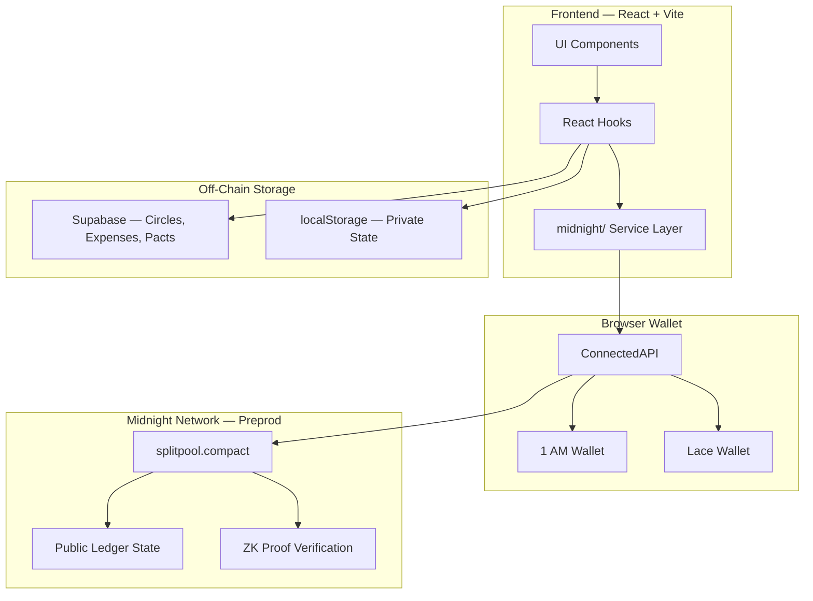
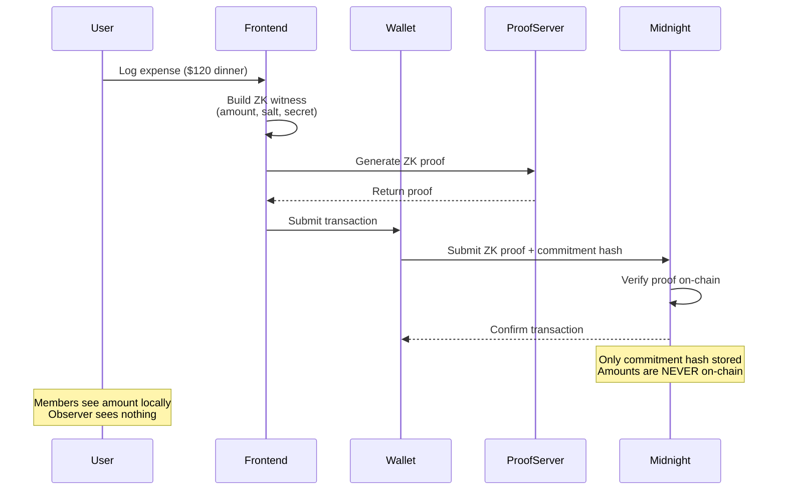
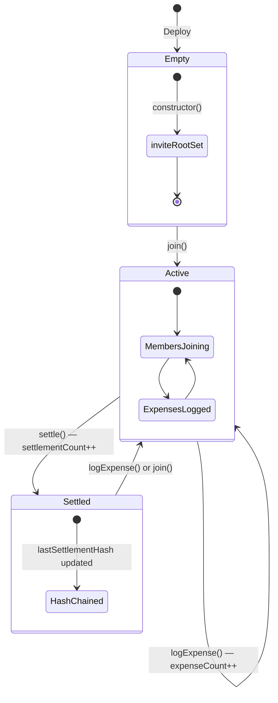
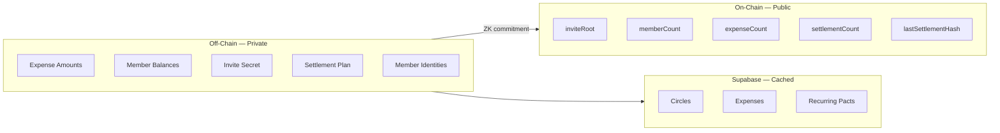
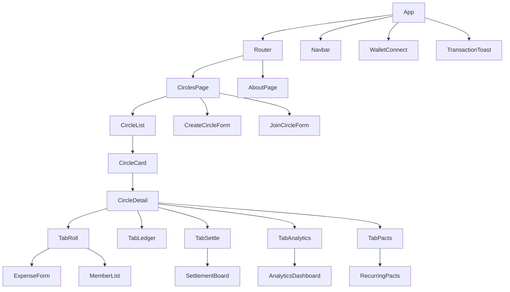
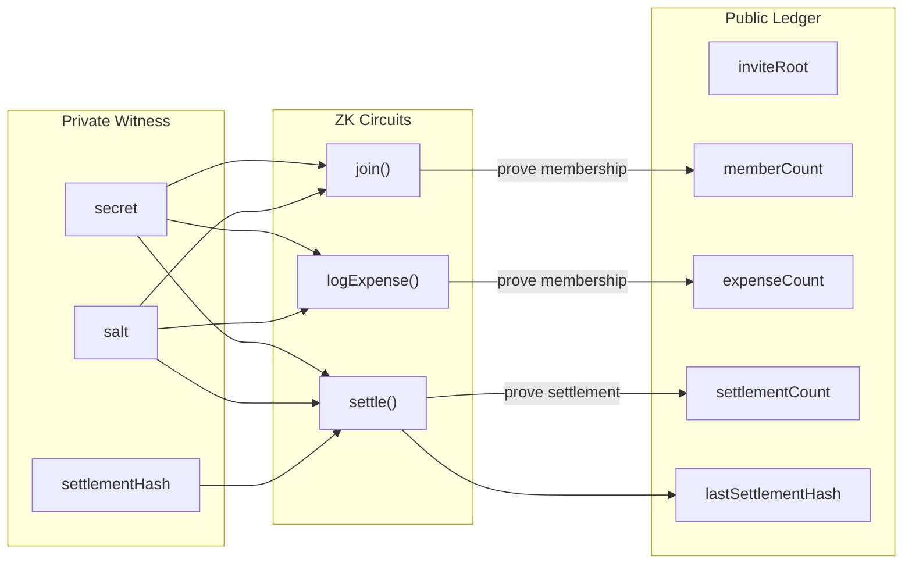

# Meridian — Architecture

## System Overview



---

## ZK Privacy Flow



---

## Contract State Machine



---

## On-Chain vs Off-Chain Data



---

## Settlement Engine Flow

```mermaid
flowchart TD
    A[Circle Members] --> B[Log Expenses]
    B --> C[computeMinimumTransfers]
    C --> D{Net Balances}
    D -->|Creditors| E[People owed money]
    D -->|Debtors| F[People who owe]
    E --> G[Match pairs]
    F --> G
    G --> H{Single transfer needed?}
    H -->|Yes| I[1 payment]
    H -->|No| J[Chain: debtor → creditor]
    J --> K[settle() — ZK proof on-chain]
    I --> K
    K --> L[settlementCount++<br/>lastSettlementHash updated]
```

---

## Frontend Component Tree



---

## ZK Circuit Architecture



---

## Data Flow Summary

| Action | Private Input | ZK Proof | On-Chain State |
|--------|---------------|----------|----------------|
| Create circle | invite secret, salt | `commitSecret(s, salt)` | `inviteRoot` set |
| Join circle | invite secret, salt | Proves `inviteRoot == commitSecret(s, salt)` | `memberCount++` |
| Log expense | amount, secret, salt | Proves membership | `expenseCount++` |
| Settle | settlement plan, secret, salt | Proves membership + correctness | `settlementCount++`, `lastSettlementHash` updated |
